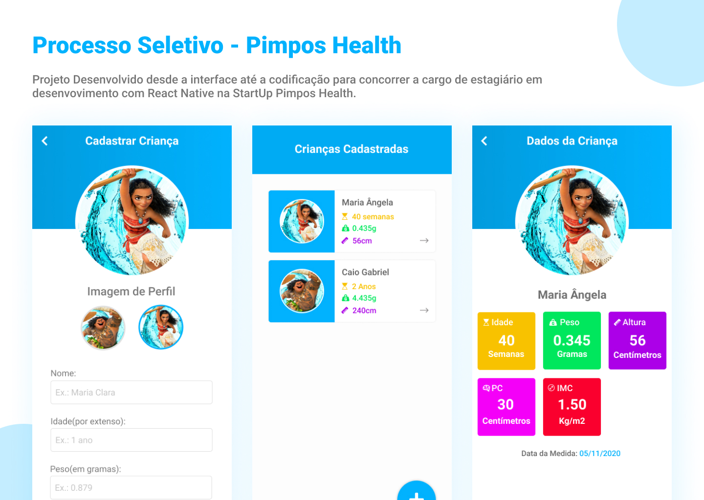

  

<h3>💻 Descrição do Projeto: </h3>

Esse app é um teste técnico que será utilizado como 
critério avaliativo para uma vaga de estágio em
desenvolvimento mobile com React Native.

<h3>🔨 Tecnologias Usadas: </h3>
<ul>
  <li>React Native</li>
  <li>TypeScript</li>
  <li>MockApi</li>
  <li>React Navigation V5</li>
</ul>

<h3>🌟 Funcionalidades: </h3>
<ul>
  <li>Listagem de crianças cadastradas</li>
  <li>Cadastro de crianças e medidas</li>
  <li>Excluir crianças já cadastradas</li>
  <li>Atualizar dados de crianças</li>
</ul>

 

Direitos autorais das imagens(apenas utilizadas com propósito educional e de estudo) são totalmente da Disney

